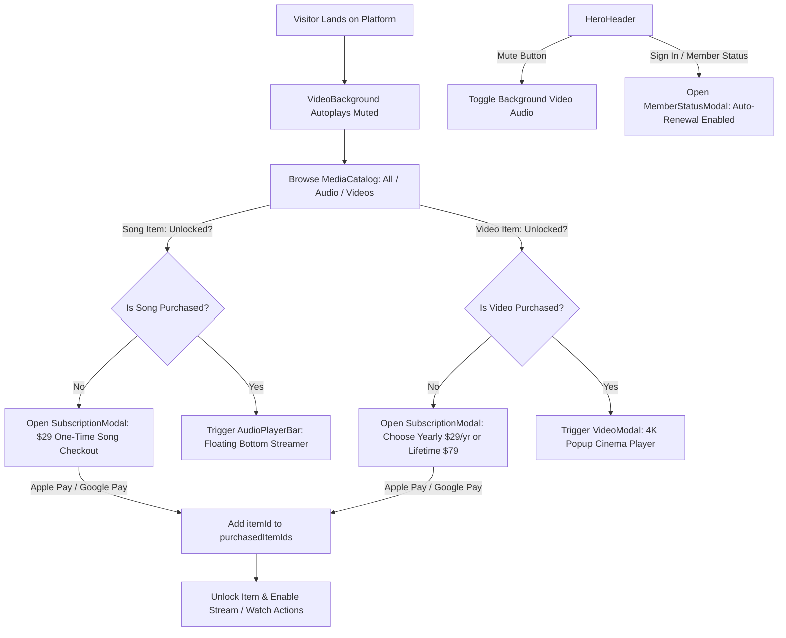

# Petron Artist Platform — System Workflow & Architecture Documentation

## 1. System Overview

**Petron** is a luxury, glassmorphic direct-to-fan media distribution platform built with Next.js 16 (App Router), TypeScript, Tailwind CSS v4, and shadcn/ui. 

The platform allows artists to showcase exclusive music singles, stem packages, and 4K visualizers with a per-item digital store and subscription monetization engine.



---

## 2. Core Architectural & Design Principles

1. **Per-Item Monetization Model**:
   - Every single audio track and every single video is purchased on an individual item basis (`purchasedItemIds: string[]`).
   - Purchasing an audio track unlocks that specific track for bottom streaming.
   - Purchasing a video unlocks that specific video for high-definition popup viewing.
2. **100% Transparent Glassmorphism**:
   - All interactive controls, cards, headers, modal dialogues, and buttons feature transparent backgrounds with ultra-sheer borders and glassmorphic backdrops.
   - The looping background video remains visible through every section of the UI.
3. **Frictionless Entry**:
   - No landing gates or "Click to Enter" modals. The background video (`/video.mp4`) autoplays muted in an infinite loop.
   - Users can toggle audio for the background video at any time via the top-left mute button.
4. **Express Checkout**:
   - Simulated 1-click **Apple Pay** and **Google Pay** payment sheets for frictionless purchasing.

---

## 3. Detailed Component Breakdown

### 3.1. Master Controller: `HomeView`
- **File**: [`components/home/home-view.tsx`](file:///a:/Fiverr/petron/components/home/home-view.tsx)
- **Role**: Coordinates global state:
  - `subscription`: Current user subscription status and list of `purchasedItemIds`.
  - `activeItem`: Currently active audio track playing in `AudioPlayerBar`.
  - `selectedPaymentItem`: Active item being checked out inside `SubscriptionModal`.
  - `selectedVideoItem`: Active video item loaded into `VideoModal`.
  - `isMuted`: Audio mute toggle for the ambient background video.
  - `isMemberModalOpen`: Visibility of customer profile/subscription manager.

---

### 3.2. Ambient Media Layer: `VideoBackground`
- **File**: [`components/home/video-background.tsx`](file:///a:/Fiverr/petron/components/home/video-background.tsx)
- **Role**: Fullscreen ambient video element playing `/video.mp4` with `object-cover` and GPU acceleration.
- **Behavior**:
  - Always rendered at `z-0` beneath the content layer.
  - Controlled by the `isMuted` state passed from `HomeView`.
  - Free from intrusive full-page entry gates.

---

### 3.3. Navigation & Status Bar: `HeroHeader`
- **File**: [`components/home/hero-header.tsx`](file:///a:/Fiverr/petron/components/home/hero-header.tsx)
- **Role**: Top navigation bar with artist metadata and persistent utility actions.
- **Features**:
  - **Ambient Audio Toggle**: Top-left volume button (`Volume2` / `VolumeX`) with visual sound wave indicator.
  - **Artist Identity**: Avatar, artist handle (`@PETRON`), location badge, and verified badge.
  - **Social Links**: Direct links to Instagram, SoundCloud, Spotify, and YouTube.
  - **Live Metrics**: Viewer counter and PRO member count indicator.
  - **Account Status**: Pill button showing "Sign In" or "Member Active" which triggers `MemberStatusModal`.

---

### 3.4. Catalog & Digital Store: `MediaCatalog`
- **File**: [`components/home/media-catalog.tsx`](file:///a:/Fiverr/petron/components/home/media-catalog.tsx)
- **Role**: Main showcase of digital assets with category filtering and access state verification.
- **Filter Tabs**:
  - `All Items`: Shows all available audio and video items.
  - `Audio`: Filtered list of music singles and stem packages.
  - `Videos`: Filtered list of 4K studio visualizers and films.
- **Item Cards**:
  - **Locked Audio**: Displays transparent "Buy $29" button with lock icon $\rightarrow$ triggers `SubscriptionModal`.
  - **Unlocked Audio**: Displays transparent "Stream" button with play icon $\rightarrow$ triggers `AudioPlayerBar`.
  - **Locked Video**: Displays transparent "Subscribe" button with lock icon $\rightarrow$ triggers `SubscriptionModal`.
  - **Unlocked Video**: Displays transparent "Watch" button with play icon $\rightarrow$ triggers `VideoModal`.

---

### 3.5. Audio Playback Streamer: `AudioPlayerBar`
- **File**: [`components/home/audio-player-bar.tsx`](file:///a:/Fiverr/petron/components/home/audio-player-bar.tsx)
- **Role**: Floating bottom dock that mounts when an unlocked song is clicked.
- **Features**:
  - Play/Pause toggle with animated playback simulation.
  - Real-time scrubbing progress bar with current and total duration timecodes.
  - Track thumbnail, title, artist name, and dismiss button.
  - Ultra-clear glassmorphism styling that floats above the background.

---

### 3.6. 4K Cinema Viewer: `VideoModal`
- **File**: [`components/home/video-modal.tsx`](file:///a:/Fiverr/petron/components/home/video-modal.tsx)
- **Role**: Dedicated modal popup for watching unlocked exclusive videos.
- **Features**:
  - HTML5 video player with standard playback controls (`play`, `pause`, `scrubber`, `fullscreen`).
  - 4K Ultra HD badge and duration display.
  - Video tags and genre metadata.
  - Transparent backdrop and header with close button.

---

### 3.7. Checkout & Payment Engine: `SubscriptionModal`
- **File**: [`components/home/subscription-modal.tsx`](file:///a:/Fiverr/petron/components/home/subscription-modal.tsx)
- **Role**: Payment sheet modal supporting 1-click Apple Pay and Google Pay.
- **Per-Item Monetization Schemes**:
  1. **Song Checkout ($29)**:
     - Single one-time purchase.
     - Unlocks immediate audio streaming rights for the selected song.
  2. **Video Checkout (Dual Choice)**:
     - **Yearly Access ($29 / year)**: 12 months recurring streaming access for the selected video.
     - **Lifetime Access ($79 one-time)**: Permanent unlocked access for the selected video.
- **Payment Processing**:
  - Simulated instant processing with spinner states.
  - Automatic addition of `itemId` into `purchasedItemIds`.
  - Instant transition of catalog card to "Stream" or "Watch".

---

### 3.8. Member Management: `MemberStatusModal`
- **File**: [`components/home/member-status-modal.tsx`](file:///a:/Fiverr/petron/components/home/member-status-modal.tsx)
- **Role**: Account status viewer and authentication sheet.
- **Features**:
  - Customer ID and account email display.
  - **Auto Renewal Indicator**: Fixed status marked as `Auto Renewal: Enabled`.
  - Active tier badge and access expiration timecode.
  - Sign In / Sign Out actions.

---

## 4. Data Models & Type Definitions

Defined in [`components/home/types.ts`](file:///a:/Fiverr/petron/components/home/types.ts):

```typescript
export type MediaType = "song" | "video"

export interface MediaItem {
  id: string
  title: string
  type: MediaType
  duration: string
  releaseDate: string
  isExclusive: boolean
  genre?: string
  bpm?: string
  tags?: string[]
  price: number
  thumbnailUrl?: string
}

export type SubscriptionTier = "free" | "yearly" | "lifetime"

export interface UserSubscription {
  tier: SubscriptionTier
  email: string | null
  activeUntil: string | null
  autoRenew: boolean
  purchasedItemIds?: string[]
}
```

---

## 5. Summary Matrix of User Actions

| Action Target | Current State | Triggered Flow | Resulting UI Response |
| :--- | :--- | :--- | :--- |
| **Song Item Card** | Locked | Click "Buy $29" | Opens `SubscriptionModal` with $29 Song Purchase scheme. |
| **Song Item Card** | Unlocked | Click "Stream" | Loads song into `AudioPlayerBar` and begins playback. |
| **Video Item Card** | Locked | Click "Subscribe" | Opens `SubscriptionModal` with Yearly ($29/yr) vs Lifetime ($79) scheme. |
| **Video Item Card** | Unlocked | Click "Watch" | Opens `VideoModal` popup with 4K video player. |
| **Top-Left Sound Button**| Muted / Active | Click Button | Toggles background video audio on/off immediately. |
| **Sign In / Member Pill** | Signed Out / In | Click Pill | Opens `MemberStatusModal` showing active plan & Auto-Renewal: Enabled. |
| **Payment Button** | Checkout Pending| Click Apple / Google Pay| Completes simulated payment, adds item ID to `purchasedItemIds`, unlocks card. |
