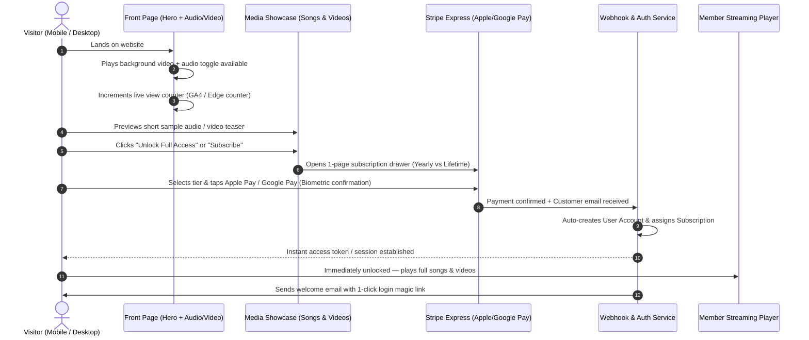
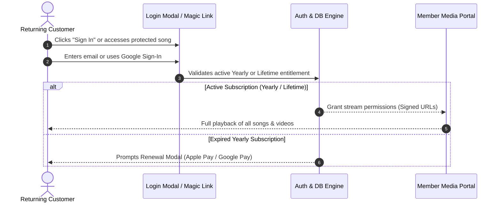

# Project Architecture & Workflow Specification

A comprehensive technical and functional blueprint for the creator platform combining a **guns.lol aesthetic profile front-page** with a **Patreon-style single-page subscription & media delivery system**.

---

## 1. Executive Summary & Core Concept

### 1.1 Overview
The platform allows an artist/creator to showcase and sell exclusive access to their songs, music videos, and digital content. It fuses two distinct models into a seamless user experience:
1. **Front-End Vibe (Guns.lol Inspiration)**: An atmospheric, immersive landing page with a looping background video, ambient background music with an audio toggle, creator status, social links, and live view count analytics.
2. **Monetization Engine (Patreon Inspiration)**: A clean, frictionless single-page subscription checkout. Visitors can unlock all songs and videos via **Yearly Subscription** or **Lifetime Access** with 1-click biometric payments (**Apple Pay** and **Google Pay**).
3. **Frictionless Onboarding**: Account registration is combined with the payment process. Users never deal with tedious multi-step forms before paying. Access is granted instantly, and returning customers can log in at any time to stream their media.

---

## 2. Complete User Journey & Flowcharts

### 2.1 First-Time Visitor to Member Flow



### 2.2 Returning Customer Login Flow



---

## 3. Subscription & Pricing Tiers

| Feature | Tier 1: Yearly Subscription | Tier 2: Lifetime Access |
| :--- | :--- | :--- |
| **Billing Model** | Recurring annual charge (e.g., $29/year) | One-time single payment (e.g., $79) |
| **Duration** | 365 days from purchase date | Permanent / Indefinite |
| **Cancellation Policy** | Can cancel anytime; keeps access until year ends | Non-expiring, no cancellation needed |
| **Songs Access** | Full uncompressed audio streaming + lyrics | Full uncompressed audio streaming + lyrics |
| **Videos Access** | Full 1080p/4K music videos & behind-the-scenes | Full 1080p/4K music videos & behind-the-scenes |
| **Future Releases** | Unlocked as long as subscription is active | Unlocked forever for all present & future drops |
| **Express Payment** | Apple Pay / Google Pay / Credit Card | Apple Pay / Google Pay / Credit Card |

---

## 4. Front-End Layout & UI Workflow

### 4.1 Page Structure (Single-Page Experience)

```
+--------------------------------------------------------------------+
|  [🔊 Audio Toggle]                             [🔑 Sign In / Portal] |
|                                                                    |
|                       BACKGROUND VIDEO LOOP                        |
|                                                                    |
|                           [ ARTIST AVATAR ]                        |
|                              Artist Name                           |
|                       🔴 User Status / Badge                       |
|                                                                    |
|              [✉ Email] [▶ YouTube] [📷 IG] [🎵 TikTok]             |
|                                                                    |
|                           👁 1,918 Views                           |
|                                                                    |
+--------------------------------------------------------------------+
|                                                                    |
|                    EXCLUSIVE SONGS & VIDEOS                        |
|                                                                    |
|   +--------------------------+    +--------------------------+     |
|   |  🎵 Song Title 1         |    |  🎵 Song Title 2         |     |
|   |  [Waveform / 30s Sample] |    |  [Waveform / 30s Sample] |     |
|   |  🔒 LOCKED (Subscribers) |    |  🔒 LOCKED (Subscribers) |     |
|   +--------------------------+    +--------------------------+     |
|                                                                    |
|   +--------------------------+    +--------------------------+     |
|   |  🎬 Music Video 1        |    |  🎬 Exclusive Video 2    |     |
|   |  [Blurred Preview]       |    |  [Blurred Preview]       |     |
|   |  🔒 LOCKED (Subscribers) |    |  🔒 LOCKED (Subscribers) |     |
|   +--------------------------+    +--------------------------+     |
|                                                                    |
|              [ ⚡ UNLOCK ALL ACCESS (Patreon Flow) ]                |
+--------------------------------------------------------------------+
|                                                                    |
|        SUBSCRIPTION DRAWER / MODAL (Triggered on Click)            |
|                                                                    |
|   +-------------------------+     +-------------------------+      |
|   |       YEARLY PASS       |     |      LIFETIME PASS      |      |
|   |       $29 / year        |     |       $79 one-time      |      |
|   |  • All songs & videos   |     |  • Lifetime VIP access  |      |
|   |  • Cancel anytime       |     |  • Never pay again      |      |
|   +-------------------------+     +-------------------------+      |
|                                                                    |
|             [  Pay  Pay with Apple Pay (Face ID)  ]               |
|             [  GPay  Pay with Google Pay (Biometric) ]             |
|             [  💳   Pay with Card / Other Methods  ]               |
|                                                                    |
+--------------------------------------------------------------------+
```

### 4.2 UI Component Details

1. **Ambient Video Background (guns.lol style)**:
   - Fullscreen HTML5 `<video>` looping smoothly with CSS overlay to preserve text legibility.
   - Fixed Audio Toggle Icon button (top-left) letting the visitor mute/unmute the theme track at will.
   - Fallback poster image for low-bandwidth devices or battery-saving mobile modes.

2. **Artist Identity & Socials**:
   - Artist handle/logo typography with subtle glitch or shimmer styling.
   - Status tag (e.g. `discord.gg/guns` or verified creator badge).
   - Minimalist social icon row (Email, YouTube, Instagram, TikTok, Spotify/SoundCloud).
   - Dynamic view count badge (`👁 1,918`) integrated with Google Analytics / database counter.

3. **Media Catalog (Teaser Mode)**:
   - **Audio Track Cards**: Interactive audio waveforms with 30-second previews. A locked badge indicates full high-definition download and stream require an active pass.
   - **Video Cards**: Embedded video players with 15-second teaser clips and a blurred overlay prompting upgrade for full 4K view.

4. **Patreon-Inspired Subscription Checkout Modal**:
   - Triggered either by clicking a locked track, the "Unlock All" floating bar, or the header "Subscribe" button.
   - Two side-by-side cards: **Yearly** vs. **Lifetime**.
   - Direct integration of **Stripe Payment Request Button**:
     - On iOS/Safari: Displays **Apple Pay** button automatically, triggering Face ID / Touch ID.
     - On Android/Chrome: Displays **Google Pay** button automatically, triggering fingerprint/biometric auth.
     - Fallback: Stripe card input for browsers without native digital wallets.

---

## 5. Frictionless Registration & Auth Architecture

A core client requirement is that **account creation happens directly with payment**, eliminating high-friction registration barriers.

### 5.1 The "Payment-First" Account Creation Architecture

```
1. Visitor selects "Yearly" or "Lifetime" and taps Apple Pay / Google Pay.
2. Apple Pay / Google Pay automatically exposes the user's verified email address in the Stripe payment token.
3. Stripe Webhook fires `checkout.session.completed` or `payment_intent.succeeded`.
4. The Backend:
   a. Checks if a user with that email already exists.
   b. If not, automatically creates the user record:
      - Email: derived from Apple Pay / Google Pay metadata.
      - Auth Method: Passwordless Magic Link / Auto-session.
   c. Creates or updates the Subscription record:
      - Tier: `yearly` or `lifetime`
      - Status: `active`
      - Current Period End: 1 year from now (or permanent timestamp for lifetime)
5. The front-end immediately unlocks protected media via active session cookie / JWT.
6. A transactional email is sent to the customer:
   - Subject: "Your VIP Access is Unlocked!"
   - Contains: Direct 1-click magic login link to access their library on any device at any time.
```

### 5.2 Subscription State Machine

```
               [ VISITOR / GUEST ]
                        │
                        ▼ (Apple Pay / Google Pay)
               [ ACTIVE_SUBSCRIBER ]
                  │             │
        (Yearly Plan)      (Lifetime Plan)
                  │             │
                  │             ▼
                  │       [ PERMANENT_ACCESS ]
                  │        (Never expires)
                  ▼
        (User Cancels Yearly)
                  │
                  ▼
     [ CANCELLED_PENDING_EXPIRATION ]
   (Access remains until 365 days end)
                  │
                  ▼ (Period ends)
              [ EXPIRED ]
                  │
                  ▼ (Renew button)
               [ ACTIVE ]
```

---

## 6. Technical Stack & Architecture

### 6.1 Technology Choices

| Domain | Technology | Justification |
| :--- | :--- | :--- |
| **Framework** | Next.js 16 (App Router) + TypeScript | High performance, server actions, dynamic edge rendering, SEO-ready. |
| **Styling & UI** | Tailwind CSS + shadcn/ui | Minimalist, clean aesthetics, zero visual clutter, compliant with design guidelines. |
| **Icons** | Lucide React | Lightweight, accessible iconography. |
| **Payments** | Stripe Billing + Stripe Elements | Native support for Apple Pay, Google Pay, recurring subscriptions, and one-off lifetime charges. |
| **Authentication** | NextAuth / Auth.js (or Supabase Auth) | Seamless passwordless Magic Links + Google Provider + JWT session cookies. |
| **Database** | PostgreSQL (Prisma ORM / Supabase) | Relational integrity for Users, Subscriptions, Payments, and Media. |
| **Media Hosting** | Cloudflare Stream / AWS S3 + Signed URLs | Protects songs and videos from direct URL scraping; tokens expire after playback. |
| **Analytics** | Google Analytics 4 + Edge View Tracker | Accurate pageview counting and user engagement metrics. |

---

## 7. Data Models & Database Schema

```prisma
datasource db {
  provider = "postgresql"
  url      = env("DATABASE_URL")
}

enum SubscriptionTier {
  YEARLY
  LIFETIME
}

enum SubscriptionStatus {
  ACTIVE
  CANCELLED
  EXPIRED
  PAST_DUE
}

enum MediaType {
  SONG
  VIDEO
}

model User {
  id            String         @id @default(cuid())
  email         String         @unique
  name          String?
  createdAt     DateTime       @default(now())
  updatedAt     DateTime       @updatedAt
  subscriptions Subscription[]
}

model Subscription {
  id                   String             @id @default(cuid())
  userId               String
  user                 User               @relation(fields: [userId], references: [id], onDelete: Cascade)
  tier                 SubscriptionTier
  status               SubscriptionStatus @default(ACTIVE)
  stripeCustomerId     String?            @unique
  stripeSubscriptionId String?            @unique
  stripePriceId        String?
  startDate            DateTime           @default(now())
  currentPeriodEnd     DateTime?          // Null for Lifetime, +365 days for Yearly
  cancelAtPeriodEnd    Boolean            @default(false)
  createdAt            DateTime           @default(now())
  updatedAt            DateTime           @updatedAt
}

model MediaItem {
  id           String    @id @default(cuid())
  title        String
  type         MediaType
  description  String?
  thumbnailUrl String?
  previewUrl   String    // Public 30s audio sample or 15s video teaser
  fullMediaUrl String    // Secure streaming source (signed URL only)
  durationSec  Int
  sortOrder    Int       @default(0)
  createdAt    DateTime  @default(now())
}

model PageAnalytics {
  id        String   @id @default(cuid())
  path      String   @unique @default("/")
  viewCount BigInt   @default(0)
  updatedAt DateTime @updatedAt
}
```

---

## 8. API & Route Specifications

### 8.1 API Endpoints

1. **`POST /api/checkout/create-session`**
   - **Input**: `{ tier: "YEARLY" | "LIFETIME", email?: string }`
   - **Action**: Generates a Stripe Checkout Session or PaymentIntent configured for Apple Pay & Google Pay.
   - **Output**: `{ clientSecret: string, sessionId: string }`

2. **`POST /api/webhooks/stripe`**
   - **Action**: Validates Stripe webhook signatures.
   - **Events handled**:
     - `checkout.session.completed`: Creates user and subscription record.
     - `customer.subscription.updated`: Updates renewal dates or flags cancellation status.
     - `customer.subscription.deleted`: Revokes access when yearly subscription period terminates.

3. **`GET /api/media/stream/[mediaId]`**
   - **Action**: Authenticates incoming session.
   - **Validation**: Checks if caller has active `YEARLY` or `LIFETIME` subscription.
   - **Output**: Generates short-lived signed streaming URL or chunks media directly; 403 Forbidden for unauthorized callers.

4. **`POST /api/subscription/cancel`**
   - **Action**: Sets `cancelAtPeriodEnd = true` in Stripe. Access remains valid until the current 365-day cycle finishes.

5. **`GET /api/analytics/views` & `POST /api/analytics/increment`**
   - **Action**: Increments and fetches the live view counter displayed on the guns.lol hero section.

---

## 9. Implementation Roadmap & Phases

### Phase 1: Front-Page Hero & Aesthetics (guns.lol style)
- [x] Configure Next.js layout with dark minimalist styling.
- [ ] Build responsive hero with looping background video and audio toggle button.
- [ ] Implement artist identity block, status indicator, and social link bar.
- [ ] Integrate view counter component with Google Analytics 4 script.

### Phase 2: Media Showcase & Previews
- [ ] Build audio player component with 30-second waveform teaser playback.
- [ ] Build video teaser component with blurred locked states.
- [ ] Create floating "Unlock Full Access" sticky bottom bar.

### Phase 3: Single-Page Patreon Checkout Modal
- [ ] Install and configure shadcn/ui Dialog / Drawer components.
- [ ] Present Yearly vs. Lifetime tier selector with transparent pricing.
- [ ] Integrate Stripe Elements with Apple Pay and Google Pay support via Payment Request API.

### Phase 4: Frictionless Webhook & Auto-Registration
- [ ] Implement `/api/webhooks/stripe` to handle automated user and subscription creation.
- [ ] Implement passwordless magic link email delivery for returning customer logins.
- [ ] Ensure automatic session initiation upon successful biometric payment.

### Phase 5: Gated Member Player & Subscription Management
- [ ] Build authenticated member dashboard / player where unlocked songs and full videos play.
- [ ] Build self-service subscription management (view expiry date, cancel yearly renewal).
- [ ] Secure streaming endpoints with token validation.

---

## 10. Required Credentials & Configuration Checklist

To make the system live, the following API keys and accesses must be provided:
- [ ] **Stripe Account**: Secret Key, Publishable Key, Webhook Secret.
- [ ] **Apple Pay Merchant Domain Verification**: Hosted `.well-known/apple-developer-merchantid-domain-association`.
- [ ] **Google Pay**: Verified in Stripe Dashboard (enabled by default with HTTPS).
- [ ] **Google Analytics**: GA4 Measurement ID (`G-XXXXXXXXXX`).
- [ ] **Database**: PostgreSQL connection URI (e.g. Supabase, Neon, or Railway).
- [ ] **Email Provider**: Resend or SendGrid API Key for transactional magic links.
- [ ] **Media Assets**: Hero background video file, creator songs (.mp3/.wav), and videos (.mp4).
